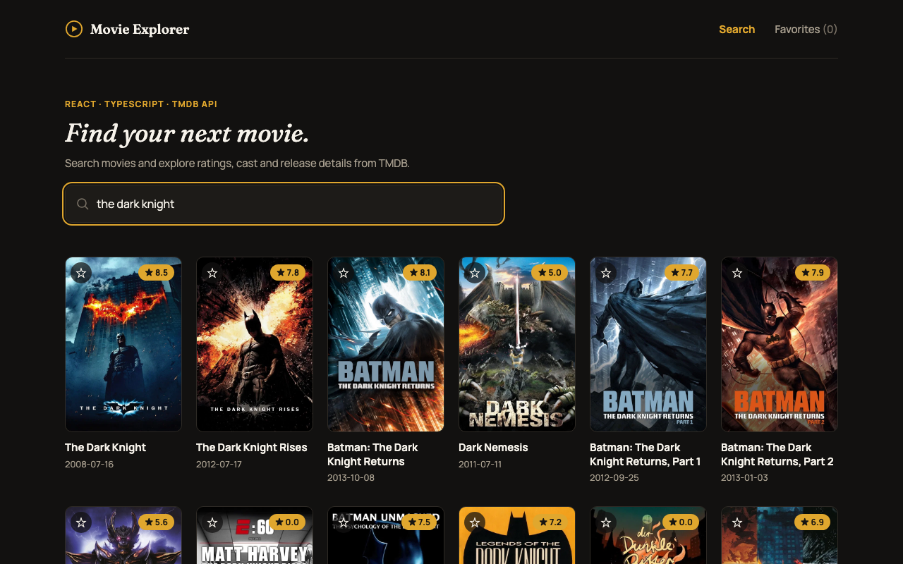
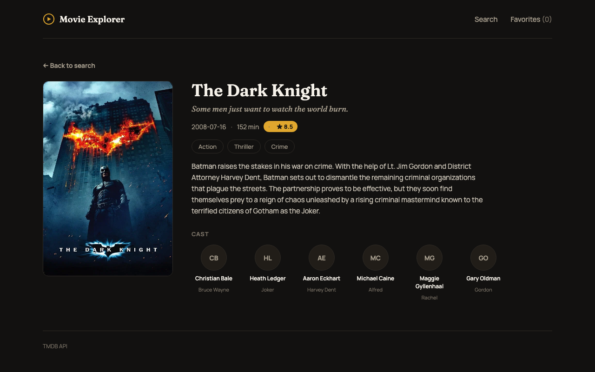

# Movie Explorer — React + TypeScript

A small production-style React + TypeScript project built as a code sample for my portfolio, showing how I structure a client app end to end: typed API layer, debounced/cancellable search, tests, CI, and linting.

It connects to the TMDB API to search for movies and display posters, ratings and release dates.

[](https://github.com/baiser92/movie_example/actions/workflows/ci.yml)

**Live demo:** [movie-sample-mauve.vercel.app](https://movie-sample-mauve.vercel.app) — no setup or API key needed, just open the link.

## Screenshots

| Search                                             | Movie detail                                     |
| -------------------------------------------------- | ------------------------------------------------ |
|  |  |

## Why TMDB?

TMDB provides movie and TV metadata through an API. A free developer API key can be used for non-commercial projects with the required attribution.

## Setup

Only needed if you want to run it locally — the live demo linked above already works without any of this.

1. Create a free [TMDB account](https://www.themoviedb.org/signup), then go to **Settings → API** ([themoviedb.org/settings/api](https://www.themoviedb.org/settings/api)) and request an API Read Access Token (the long JWT-style one, not the short v3 key).
2. Copy `.env.example` to `.env` and paste your token in:

```bash
cp .env.example .env
```

```env
VITE_TMDB_ACCESS_TOKEN=your_token_here
```

3. Install and run:

```bash
npm install
npm run dev
```

## Features

- Debounced, cancellable movie search
- Movie detail page (tagline, genres, runtime, cast) with client-side routing
- Paginated search results
- Favorites, persisted to `localStorage` and kept in sync across the app

## Architecture

- `api/` — external API communication
- `components/` — reusable UI components
- `hooks/` — data-fetching/state logic
- `pages/` — route-level views
- `types/` — domain types
- `App.tsx` — routes and page composition

The API layer is kept separate from the UI so the data source can be replaced without changing the components.

## Trade-offs

This is a client-only app: it calls the TMDB API directly from the browser using a `VITE_`-prefixed token, which Vite inlines into the public JS bundle at build time. That's fine for a read-only, non-commercial TMDB token (worst case someone burns your request quota), but it's not a pattern to reuse for a token that grants write access or costs money per request. A production app with a paid or sensitive API key would proxy the request through a backend (e.g. a serverless function) so the key never reaches the client.
